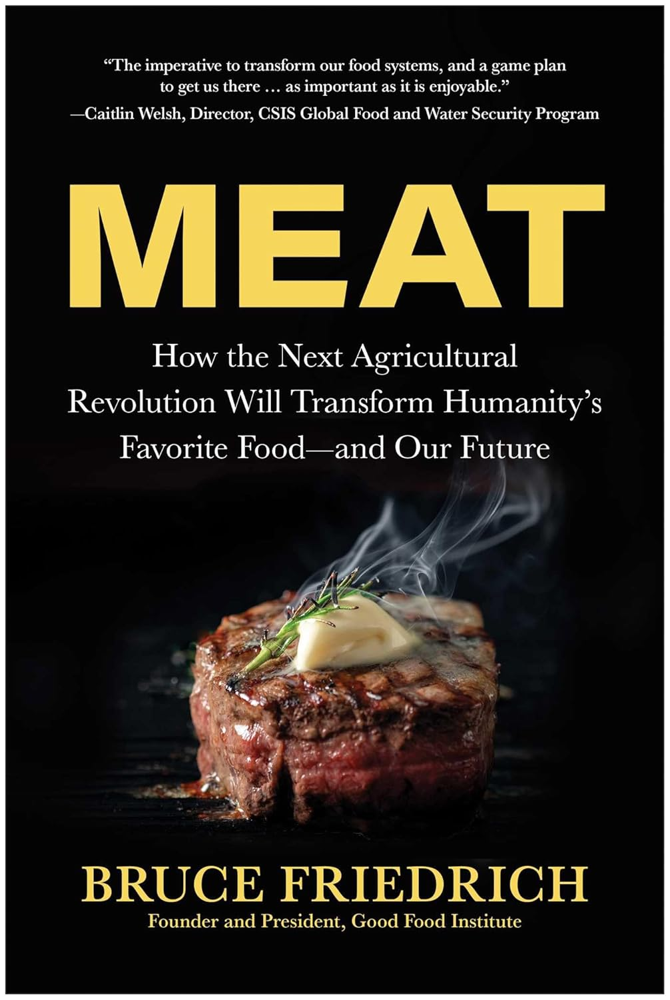

```{r setup, include=FALSE}
pkg_resources <- system.file("rmarkdown/templates/foodlab_presentation",
                             package = "foodlabslides")

theme_file <- file.path(pkg_resources, "resources/beamerthemeFoodLab.sty")
if (file.exists(theme_file)) {
  file.copy(theme_file, "beamerthemeFoodLab.sty", overwrite = TRUE)
}

preamble_file <- file.path(pkg_resources, "skeleton/preamble.tex")
if (file.exists(preamble_file) && !file.exists("preamble.tex")) {
  file.copy(preamble_file, "preamble.tex", overwrite = FALSE)
}

logo_file <- file.path(pkg_resources, "skeleton/foodlab-logo.png")
if (file.exists(logo_file)) {
  file.copy(logo_file, "foodlab-logo.png", overwrite = TRUE)
}

knitr::opts_chunk$set(echo = FALSE)
```

## HSFL overview

::::: columns
::: {.column width="52%"}
\includegraphics[width=\linewidth, height=0.68\textheight, keepaspectratio]{images/foodlabstanford-homepage.png}
:::

::: {.column width="48%"}
- Hi, I'm Seth, I'm a Research scientist, Humane & Sustainable Food Lab at Stanford ([foodlabstanford.com](https://www.foodlabstanford.com/))
- Founded in early 2023 to accelerate the end of factory farming
- I joined July 2024, I write meta-analyses (and [a Substack](https://regressiontothemeat.substack.com/)) and run experiments
:::
:::::

## Meaningfully reducing MAP consumption is hard

::::: columns
::: {.column width="62%"}
{width="100%"}
:::

::: {.column width="38%"}
- [Meta-analytic review](https://doi.org/10.1016/j.appet.2025.108233) of MAP reduction interventions
- Only RCTs, $\geq$ 25 per arm, direct consumption measure, $\geq$ 1 day follow-up
- Thousands of papers $\rightarrow$ 35
:::
:::::

## What was tried?

::::: columns
::: {.column width="50%"}
{width="100%"}
:::

::: {.column width="50%"}
- **Persuasion**: animal welfare, environment, health
- **Choice architecture**: nudges, defaults
- **Psychology**: mostly norms experiments

\bigskip

**Overall: small, sparse effects** — generally a few percentage points
:::
:::::

## Movement leaders reached the same conclusion

::::: columns
::: {.column width="28%"}
{width="100%"}
:::

::: {.column width="72%"}
- Around the same time, movement orgs concluded persuasion wasn't working
- **Defaults**: plant-forward menus at scale (e.g., universities, hospitals)
- **Alt proteins**: Bruce Friedrich and the Good Food Institute
- **Corporate campaigns**: cage-free, better chicken welfare standards
:::
:::::

## Defaults: sorry, I'm a skeptic

- No defaults study met our inclusion criteria :(
- No evidence either way on [regression to the meat](https://regressiontothemeat.substack.com/) (rebound at the next meal)
- One post-pub study ([Ginn & Sparkman 2024](https://www.sciencedirect.com/science/article/abs/pii/S0272494423002748)) met our criteria and found + results. but also noncompliance at one school, lower sales on default days, and no measures of spatial spillovers (what people who leave the default station do instead). So net effects on meat are a bit of guesswork (not a knock on the study!)
- Prior: things don't scale up. Especially [nduges](https://onlinelibrary.wiley.com/doi/abs/10.3982/ECTA18709) but really things in general: [site selection bias](https://academic.oup.com/qje/article-abstract/130/3/1117/1933105?login=false), less [skilled/motivated administrators](https://www.aeaweb.org/articles?id=10.1257/aer.p20171115) at scale. [publication bias](https://www.pnas.org/doi/10.1073/pnas.2200300119), & [compensating behavior in the long-run](https://www.bu.edu/bulawreview/files/2023/12/STEVENSON.pdf)

## Meat alternatives: also a skeptic

- Big question: who's the target audience? Who's going to get on board with cultured meat who isn't already on board with Impossible meat? Can you actually picture her in your mind? How big an audience is this?
- The meat alternatives industry is really struggling (Beyond Meat down \~97% from peak valuation). What's up with that?
- My belief, and I hope to persuade you about this: the inability of plant-based meats to find their foothold tells you something important about the cultured meat market.
- Survey data suggests a *lot* of resistance ([Peacock 2026](https://www.sciencedirect.com/science/article/abs/pii/S0195666325004544)).

## Recent paper that introduces plant-based alternatives

::::: columns
::: {.column width="50%"}
\includegraphics[width=\linewidth, height=0.72\textheight, keepaspectratio]{images/tacos-paper-title.png}
:::

::: {.column width="50%"}
\includegraphics[width=\linewidth, height=0.72\textheight, keepaspectratio]{images/preprint-fig.png}
:::
:::::

## Corporate campaigns: in favor, but

- Real wins: cage-free commitments, better chicken standards
- Corps renege; political wins can be reversed
- Mechanism: tapping *existing* attitudes
- Save Our Bacon Act — where's the mass pushback?
- No hearts-and-minds, no durable change

## So where does that leave us?

- Defaults, alt proteins, corporate campaigns replaced individual persuasion
- I don't see a vegan world emerging from any of these
- Best case: less cruel factory farming in 50 years
- We need something more transformational

## Let's get weirder

> "The best ideas look initially like bad ideas. If a good idea were obviously good, someone else would already have done it."
>
> --- Paul Graham

\bigskip

- If defaults were going to transform the world, they already would have
- We need ideas you'd be embarrassed to pitch

## Weird flavor 1: literally weird

::::: columns
::: {.column width="48%"}
<!-- TODO: add screenshot of fish sauce spoon study -->

\begin{center}
\fbox{\parbox[c][0.52\textheight]{0.42\textwidth}{\centering\small [TODO: fish sauce spoon study]}}
\end{center}
:::

::: {.column width="52%"}
- [Thai study](https://journals.plos.org/plosone/article?id=10.1371/journal.pone.0238642): put a hole in the fish sauce spoon
- Small reduction in fish sauce per person
- Fish sauce = anchovies, shrimp, very small animals
- At scale: a lot of lives
- Nobody pitches this at a conference
:::
:::::

## Weird flavor 2: extremely specific

- You know one cafeteria, one community really well
- You have an idea that would only work *there*
- The instinct: "I can't scale this, so why bother?"
- Don't listen to that instinct
- A real result at one place is still a result

## Weird flavor 3: really fundamental

- I want to talk to people about fear
- The scarcity mindset: "I need the most protein I can get"
- We're wealthy — we can put the meat down
- No scale, no funding pitch, no viable mechanism
- Just something I think is true
- From that: maybe something that eventually scales

## What's your weird theory of change?

- Our existing strategies aren't doing the trick
- I want more papers pursuing genuinely new ideas
- I will do IRB paperwork; I want to be a co-author
- Bring me your weird idea

\bigskip

\begin{center}
\large \href{mailto:setgree@stanford.edu}{setgree@stanford.edu}
\end{center}
