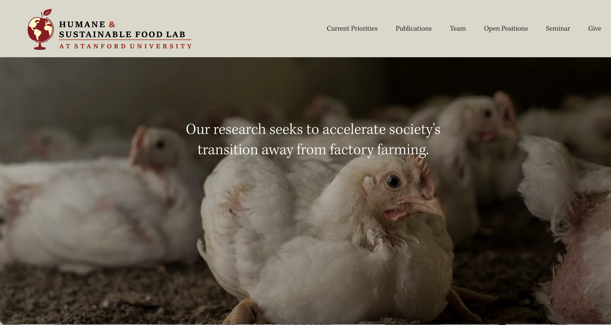
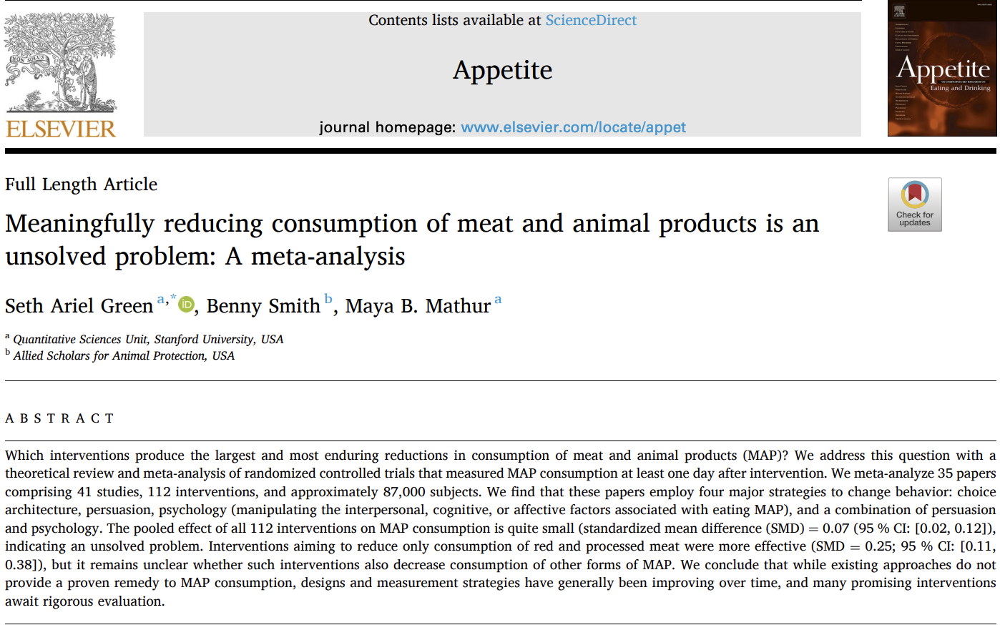
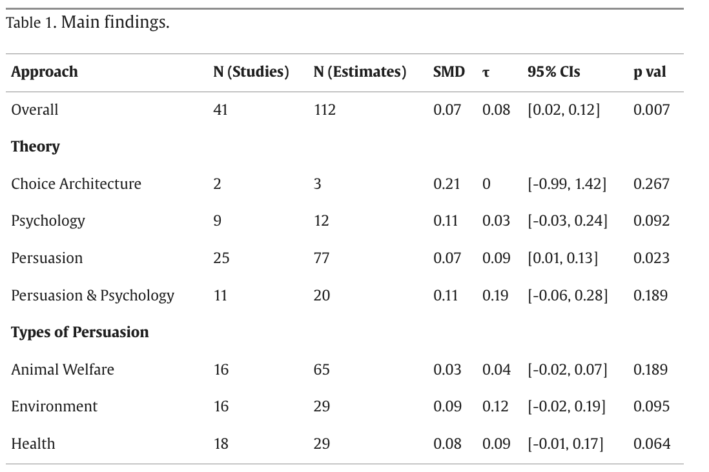
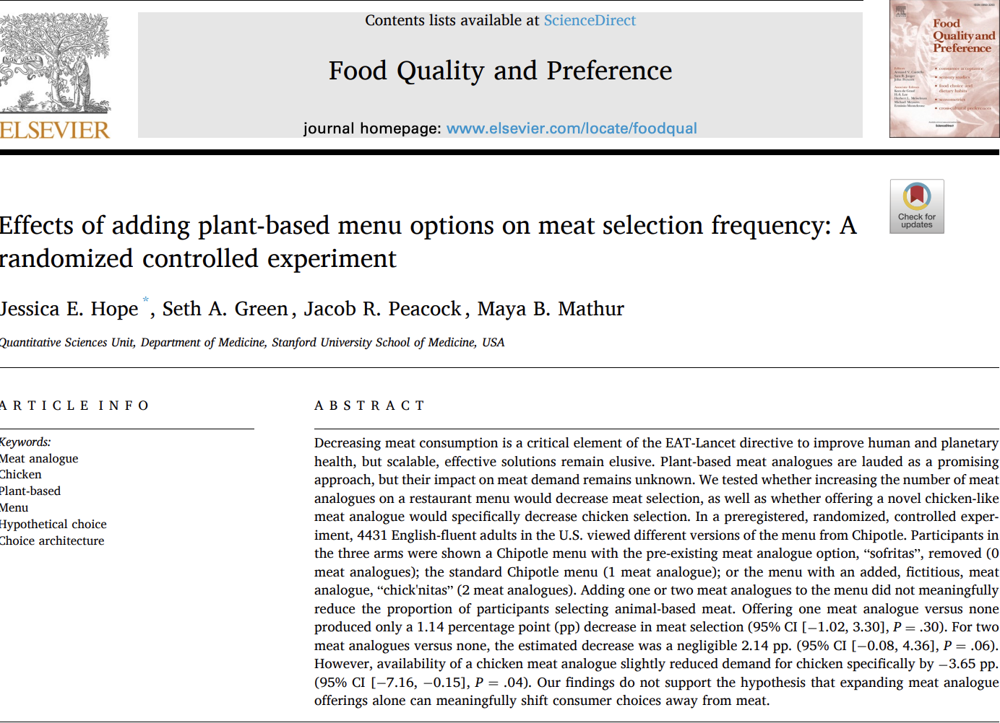
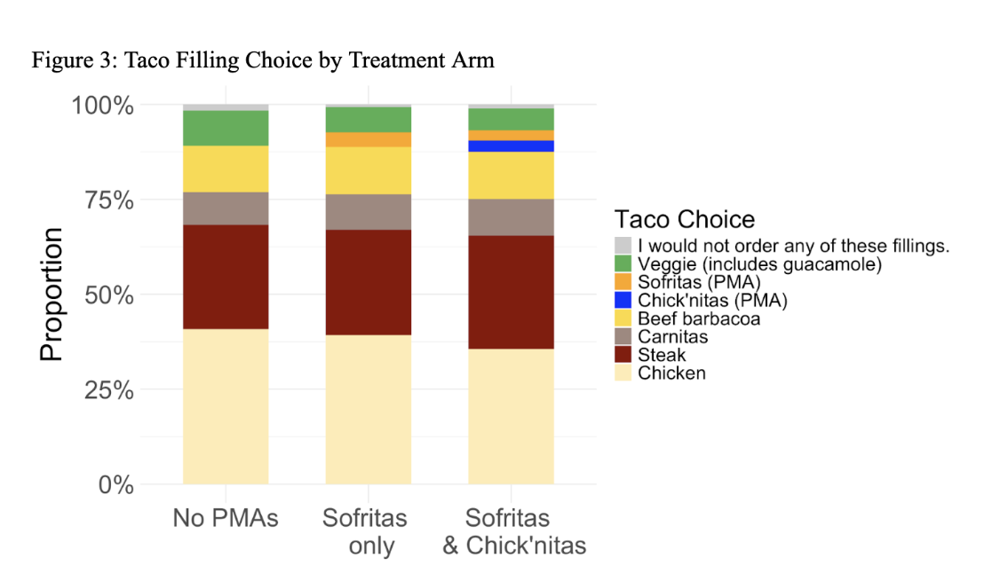

```{r setup, include=FALSE}
pkg_resources <- system.file("rmarkdown/templates/foodlab_presentation",
                             package = "foodlabslides")

theme_file <- file.path(pkg_resources, "resources/beamerthemeFoodLab.sty")
if (file.exists(theme_file)) {
  file.copy(theme_file, "beamerthemeFoodLab.sty", overwrite = TRUE)
}

preamble_file <- file.path(pkg_resources, "skeleton/preamble.tex")
if (file.exists(preamble_file) && !file.exists("preamble.tex")) {
  file.copy(preamble_file, "preamble.tex", overwrite = FALSE)
}

logo_file <- file.path(pkg_resources, "skeleton/foodlab-logo.png")
if (file.exists(logo_file)) {
  file.copy(logo_file, "foodlab-logo.png", overwrite = TRUE)
}

knitr::opts_chunk$set(echo = FALSE)
```

## Hi, I'm Seth

::::: columns
::: {.column width="50%"}
{width="100%"}
:::

::: {.column width="50%"}
- Research scientist, [Humane & Sustainable Food Lab](https://www.foodlabstanford.com/) at Stanford
- Lab founded April 2023; I joined July 2024
- Mission: accelerate the end of factory farming
- I write meta-analyses (and [a Substack](https://regressiontothemeat.substack.com/)) and run experiments
:::
:::::

## Meaningfully reducing MAP consumption is hard

::::: columns
::: {.column width="38%"}
- [Meta-analytic review](https://doi.org/10.1016/j.appet.2025.108233) of MAP reduction interventions
- Only RCTs, $\geq$ 25 per arm, direct consumption measure, $\geq$ 1 day follow-up
- Thousands of papers $\rightarrow$ 35
:::

::: {.column width="62%"}
{width="100%"}
:::
:::::

## What interventions have been tried?

::::: columns
::: {.column width="45%"}
{width="100%"}
:::

::: {.column width="55%"}
Five approaches:

- Environment
- Animal welfare
- Health
- Psychology
- Choice architecture

\bigskip

**Overall: small, sparse effects**
:::
:::::

## What the movement has concluded

- Individual persuasion isn't working at scale
- Movement orgs reached the same conclusion
- Three new strategies emerged:

\bigskip

\begin{center}
\large Defaults \quad $\cdot$ \quad Alt proteins \quad $\cdot$ \quad Corporate campaigns
\end{center}

## Defaults: I'm a skeptic

::::: columns
::: {.column width="45%"}
<!-- TODO: add screenshot of Substack post "Scaled Up" -->

\begin{center}
\fbox{\parbox[c][0.52\textheight]{0.38\textwidth}{\centering\small [TODO: Substack ``Scaled Up'' screenshot]}}
\end{center}
:::

::: {.column width="55%"}
- No defaults study met our inclusion criteria
- No evidence on rebound at the next meal
- One post-pub study: low compliance, lower sales
- Prior: things don't scale up
:::
:::::

## Meat alternatives: also a skeptic

- Beyond Meat (BYND): down \textasciitilde{}97--99% from its 2019 peak of \$234.90
- Who is the target demographic?
- No clear evidence a large "waiting" population exists
- Survey data: resistance on "artificial" / "creepy" grounds

## We have some experimental evidence

::::: columns
::: {.column width="45%"}
{width="100%"}

\bigskip

{width="100%"}
:::

::: {.column width="55%"}
\footnotesize

- Chipotle-like menu; 0, 1, or 2 plant-based options
- Adding a PMA: \textasciitilde{}1 pp. less meat each
- New PMAs mostly cannibalize other plant-based choices
- The market struggles are evidence, not just bad luck
- This applies to cultured meat too
:::
:::::

## Corporate campaigns: in favor, but

- Real wins: cage-free commitments, better chicken standards
- Corps renege; political wins can be reversed
- Mechanism: tapping *existing* attitudes
- Save Our Bacon Act — where's the mass pushback?
- No hearts-and-minds, no durable change

## So where does that leave us?

- Defaults, alt proteins, corporate campaigns replaced individual persuasion
- I don't see a vegan world emerging from any of these
- Best case: less cruel factory farming in 50 years
- We need something more transformational

## Let's get weirder

> "The best ideas look initially like bad ideas. If a good idea were obviously good, someone else would already have done it."
>
> --- Paul Graham

\bigskip

- If defaults were going to transform the world, they already would have
- We need ideas you'd be embarrassed to pitch

## Weird flavor 1: literally weird

::::: columns
::: {.column width="48%"}
<!-- TODO: add screenshot of fish sauce spoon study -->

\begin{center}
\fbox{\parbox[c][0.52\textheight]{0.42\textwidth}{\centering\small [TODO: fish sauce spoon study]}}
\end{center}
:::

::: {.column width="52%"}
- [Thai study](https://journals.plos.org/plosone/article?id=10.1371/journal.pone.0238642): put a hole in the fish sauce spoon
- Small reduction in fish sauce per person
- Fish sauce = anchovies, shrimp, very small animals
- At scale: a lot of lives
- Nobody pitches this at a conference
:::
:::::

## Weird flavor 2: extremely specific

- You know one cafeteria, one community really well
- You have an idea that would only work *there*
- The instinct: "I can't scale this, so why bother?"
- Don't listen to that instinct
- A real result at one place is still a result

## Weird flavor 3: really fundamental

- I want to talk to people about fear
- The scarcity mindset: "I need the most protein I can get"
- We're wealthy — we can put the meat down
- No scale, no funding pitch, no viable mechanism
- Just something I think is true
- From that: maybe something that eventually scales

## What's your weird theory of change?

- Our existing strategies aren't doing the trick
- I want more papers pursuing genuinely new ideas
- I will do IRB paperwork; I want to be a co-author
- Bring me your weird idea

\bigskip

\begin{center}
\large \href{mailto:setgree@stanford.edu}{setgree@stanford.edu}
\end{center}
